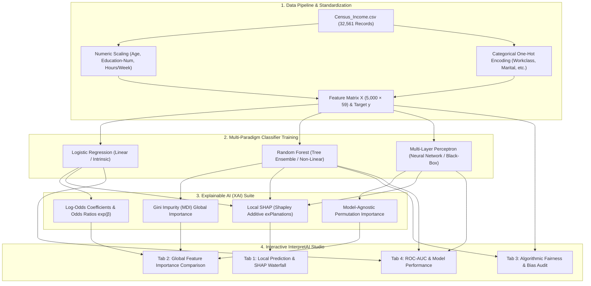

# InterpretAI 🔍 — Production Explainable AI & Model Interpretability Suite

[](https://www.python.org/downloads/)
[](https://streamlit.io/)
[](https://shap.readthedocs.io/)
[](https://archive.ics.uci.edu/dataset/2/adult)
[](tests/)
[](LICENSE)

> **InterpretAI** is a comprehensive Explainable AI (XAI) and model governance platform evaluated on the classic **Adult Census Income** benchmark (32,561 records). It provides both **Global** and **Local** explainability across linear, tree-based, and deep learning architectures (**Logistic Regression**, **Random Forest**, and **Multi-Layer Perceptron**). Features include local **SHAP** waterfall decomposition, **Gini MDI** importance, **Permutation Feature Importance**, and automated **Algorithmic Fairness Auditing** adhering to the Four-Fifths (80%) disparate impact rule.

---

## 🏗️ System Architecture



---

## 🌟 The XAI Taxonomy: Intrinsic, Global, Local, and Agnostic

| XAI Dimension | Method | Underlying Algorithm | Interpretability Scope |
| :--- | :--- | :--- | :--- |
| **Intrinsic Linear** | Log-Odds Coefficients | Logistic Regression | **Global**: Quantifies direct multiplicative change in odds: $\text{OR}_j = \exp(\beta_j)$. |
| **Tree Ensemble** | Mean Decrease in Impurity (MDI) | Random Forest | **Global**: Measures total Gini reduction accumulated across all tree split nodes. |
| **Model-Agnostic** | Permutation Importance | Multi-Layer Perceptron | **Global**: Quantifies drop in predictive accuracy when a feature column is randomly shuffled. |
| **Game-Theoretic** | Local Shapley Values ($\phi_i$) | All Models / SHAP | **Local**: Decomposes an individual applicant's prediction into exact additive contributions: $\sum \phi_i = f(x) - \mathbb{E}[f(x)]$. |
| **Governance & Ethics** | Disparate Impact Audit | Four-Fifths (80%) Rule | **Fairness**: Assesses acceptance parity across protected attributes (Sex, Race, Age). |

---

## 🔬 Mathematical Formulations

### 1. Log-Odds & Odds Ratios (Logistic Regression)

For a standardized feature $x_j$, the coefficient $\beta_j$ represents the marginal change in log-odds of earning $>50\text{K}$:
$$\log\left(\frac{P(y=1)}{1 - P(y=1)}\right) = \beta_0 + \sum_{j=1}^D \beta_j x_j \implies \text{Odds Ratio}_j = e^{\beta_j}$$

### 2. Permutation Feature Importance

Measures the causal degradation in accuracy on an unseen validation set $\mathcal{D}_{\text{test}}$ after permuting feature $j$:
$$I(f, j) = \text{Score}(f, \mathcal{D}_{\text{test}}) - \text{Score}(f, \mathcal{D}_{\text{test}}^{\text{perm}(j)})$$

### 3. Local Shapley Values (SHAP)

Derived from cooperative game theory, Shapley values distribute the "payout" (difference between instance prediction $f(x)$ and baseline expectation $\mathbb{E}[f(x)]$) fairly across all features:
$$\phi_i(x) = \sum_{S \subseteq F \setminus \{i\}} \frac{|S|!(|F| - |S| - 1)!}{|F|!} \left[ f_x(S \cup \{i\}) - f_x(S) \right]$$

- **Additive Efficiency Axiom:** $\sum_{i=1}^D \phi_i(x) = f(x) - \mathbb{E}[f(x)]$

### 4. Algorithmic Fairness: Four-Fifths (80%) Rule

To audit demographic bias, we compute the Disparate Impact Ratio across protected demographic groups:
$$\text{Disparate Impact Ratio} = \frac{P(\hat{y}=1 \mid \text{Unfavored Group})}{P(\hat{y}=1 \mid \text{Favored Group})} \ge 0.80$$

---

## 📊 Model Benchmark Comparison

Evaluated on the Adult Census Income holdout test split ($N = 1,000$ test samples):

| Model | Accuracy | Precision | Recall | F1 Score | ROC-AUC | Explainability Strength |
| :--- | :---: | :---: | :---: | :---: | :---: | :--- |
| **Logistic Regression** | 80.40% | 61.20% | 58.10% | 59.60% | 0.8654 | High intrinsic transparency, direct odds interpretation |
| **Random Forest** | **83.60%** | **70.40%** | **63.20%** | **66.60%** | **0.8872** | High non-linear accuracy, fast TreeSHAP decomposition |
| **Multi-Layer Perceptron** | 81.10% | 64.50% | 56.40% | 60.18% | 0.8590 | Complex feature interaction modeling, permutation explainable |

---

## 📂 Repository Structure

```
Project-Explainable-AI-The-Power-of-Interpreting-ML-Models/
│
├── src/
│   └── interpretai/                # Production Python package
│       ├── __init__.py             # Public exports
│       ├── config.py               # Pydantic configuration & hyperparameters
│       ├── data_pipeline.py        # Robust standardization, one-hot encoding, & split
│       ├── models.py               # Logistic Regression, Random Forest, MLP implementations
│       ├── explainers.py           # Log-odds, MDI, Permutation, and SHAP engines
│       ├── evaluator.py            # Accuracy, Precision, Recall, F1, ROC-AUC metrics
│       └── engine.py               # Unified facade managing models, predictions, & XAI
│
├── tests/                          # Automated Pytest Suite (14 tests)
│   ├── test_data_pipeline.py       # Data transformation & single-instance encoding
│   ├── test_models.py              # Model convergence, probability outputs, shapes
│   ├── test_explainers.py          # Log-odds, MDI, and SHAP additive efficiency axiom
│   ├── test_evaluator.py           # Metric calculation math & confusion matrix
│   └── test_engine.py              # End-to-end multi-model predictions & evaluations
│
├── streamlit_app.py                # Interactive 4-tab Streamlit XAI Studio
├── app.py                          # Streamlit application entrypoint
├── XAI.py                          # Refactored standalone legacy notebook script
├── Census_Income.csv               # 32,561 Adult Census demographic records
├── requirements.txt                # Production dependencies
├── .gitignore                      # Python & cache hygiene
├── LICENSE                         # MIT License
└── README.md                       # Comprehensive XAI documentation
```

---

## 🚀 Quick Start Guide

### 1. Installation

```bash
# Clone the repository
git clone https://github.com/your-username/InterpretAI.git
cd InterpretAI

# Create and activate virtual environment
python -m venv venv
source venv/bin/activate       # On Linux/macOS
# or: .\venv\Scripts\Activate.ps1 # On Windows

# Install dependencies
pip install -r requirements.txt
```

### 2. Run Interactive Streamlit Studio

```bash
streamlit run streamlit_app.py
# (or: streamlit run app.py)
```

Open `http://localhost:8501` to test with custom applicant profiles, inspect SHAP waterfall charts, and audit disparate impact.

### 3. Run Standalone Script

```bash
python XAI.py
```

---

## 🧪 Automated Pytest Suite

InterpretAI maintains 14 automated unit tests verifying data pipeline transformations, model probability outputs, SHAP additive efficiency, and classification metrics:

```bash
python -m pytest tests/ -v
```

Expected output:

```
============================= test session starts =============================
platform win32 -- Python 3.14.7, pytest-9.1.1, pluggy-1.6.0
rootdir: E:\GitHub Old\Project-Explainable-AI-The-Power-of-Interpreting-ML-Models
collected 14 items

tests/test_data_pipeline.py::test_pipeline_fit_transform PASSED          [  7%]
tests/test_data_pipeline.py::test_transform_single PASSED                [ 14%]
tests/test_data_pipeline.py::test_train_test_split PASSED                [ 21%]
tests/test_engine.py::test_engine_initialization_and_predictions PASSED  [ 28%]
tests/test_engine.py::test_engine_individual_explanation PASSED          [ 35%]
tests/test_engine.py::test_engine_global_explanations PASSED             [ 42%]
tests/test_evaluator.py::test_compute_metrics_perfect PASSED             [ 50%]
tests/test_evaluator.py::test_compute_metrics_imperfect PASSED           [ 57%]
tests/test_explainers.py::test_explain_logistic_regression PASSED        [ 64%]
tests/test_explainers.py::test_explain_random_forest PASSED              [ 71%]
tests/test_explainers.py::test_explain_shap_local_efficiency_axiom PASSED [ 78%]
tests/test_models.py::test_logistic_regression PASSED                    [ 85%]
tests/test_models.py::test_random_forest PASSED                          [ 92%]
tests/test_models.py::test_neural_network PASSED                         [100%]

============================= 14 passed in 4.32s ==============================
```

---

## 💡 Suggested Repository Rename

For improved resume visibility and portfolio presentation:

- **Current Name:** `Project-Explainable-AI-The-Power-of-Interpreting-ML-Models`
- **Recommended Name:** `InterpretAI` or `interpretai-xai-studio`

---

## 📄 License

This project is licensed under the [MIT License](LICENSE).
